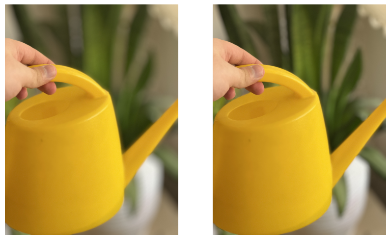
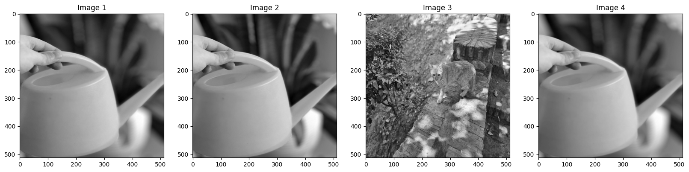

# BlurSim
One of the main problems when you are trying to train a model which has inputs with Gaussian Blur (and also outputs of the same type) is that the typical loss functions are not a good choice to use. E.g. look at the following images:

<div align="center">
  
</div>

If you do a simple _MSE_ between the two images, you will get a high value, even though the images are **very similar**! This is because the _MSE_ is very sensitive to the pixel values, and not to the structure of the image.(same thing happens if you use the _L1 loss_ or _MAE Loss_)

Now, Consider this set of images:

<div align="center">
  
</div>

With our loss function (which is explained further), the values are (alpha is set to 0.8):
```
Loss Between img_1 and img_4:
tensor(0.2681, dtype=torch.float64)

Loss Between img_1 and img_3:
tensor(16.6952, dtype=torch.float64)

Loss Between img_2 and img_3:
tensor(16.8820, dtype=torch.float64)

Loss Between img_1 and img_2:
tensor(1.5494, dtype=torch.float64)
```

## Explanation
The loss function is based on the idea that the **structure** of the image is more important than the **pixel values**. So, we use some of the classical image processing techniques to leverage this idea. The loss function contains 2 main parts `General_loss` and `Specific_loss` which will be explained further:

$$\
Loss = (1 - \alpha) \times General\_loss + \alpha \times Specific\_loss
$$

### General Loss
General loss is calculated with these steps:

1. Take DFT of image_1 and image_2
2. Calculate the magnitude of the DFTs
3. Calculate the difference between the magnitudes
4. Return the normalized difference
   
This measurement (difference of DFT magnitude spectras) shows how generally the 2 pictures are the same and are the blurring positions (and so, the detected background) are the same. This is a good measurement for the general structure of the images.

### Specific Loss
Specific loss is calculated with these steps:

1. Calculate Sobel of image_1 and image_2
2. Calculate the difference between the Sobels
3. Return the normalized difference

This measurement (difference of the Sobel filtered images) shows how specifically the 2 pictures are the same; meaning that if the position and structure of the foreground objects are the same. The reason is that Gaussian Blur smooths the image and so smooths the edges. Using sobel and an appropriate kernel size, the filtered image's output mainly contains the foreground (unblurred) objects and nothing more. So, the difference between the sobel filtered images shows how similar the foreground objects are.

## Usage
There is one hyperparameter which you should tune while training the model, and that is $\alpha$ which is the linear interpolation hyperparameter. Our recommendation is that you use decayed $\alpha$ which starts from a high value (like 0.9) and goes down to a low value (like 0.1) during the training. This is because at the beginning of the training, the model is not trained well and so the correct detection of the foreground objects is not guaranteed. So, the specific loss should be more valued at the beginning. But, as the training goes on, the model gets better and better and so the general loss should be more valued. So that the model learns to guess the correct general structure (and background regions and blurring regions) of the image.

You can simply use the loss function like this:
```python
from torch_blursim.blur_sim import BlurSim

loss = BlurSim(alpha=0.8)
...
```

# Citation
If you use this code in your research, please cite our work:
```
@misc{BlurSim,
      title={BlurSim: A New Loss Function for Training Models with Gaussian Blur Inputs},
      
      authors={AmirHossein Naghi Razlighi, Soroush Jahanzad},

      primaryClass={cs.CV}
}
```